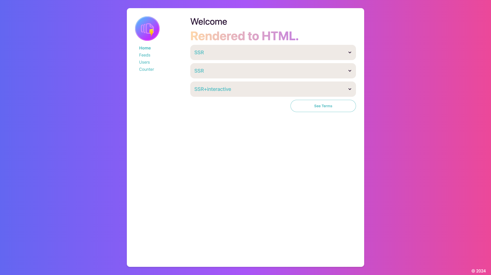

# ui

A frontend sample with framework agnostic [SSR](https://www.sanity.io/glossary/server-side-rendering) and modern data essentials (ORM, GraphQL etc.), powered by SolidJS and fully extensible for migration to alternative frameworks.



# Key Features

- SolidJS as renderer
- Framework agnostic SSR with Vike
- Framework neutral components & styling with DaisyUI & Tailwind, with modular Sass
- Real-time extensibility (simply throw in `Wonka`)
- “Backend for frontend”server integration
- E2E with `playwright`

# Available Commands

Runtime defaults to [bun](https://bun.sh/) so use the commands with `:node` appended to fall back to Node.js

- "dev": Run dev server
- "dev:node": Fall back to node for above
- "server": Run dev server with fastify - dependency: `build`
- "server:node": Fall back to node for above
- "build": Build UI to `./dist`
- "build:node": Fall back to node for above
- "build:server": Build the server with Fastify to `./dist/server`, to integrate with SSR emits - dependency: `build`
- "build:server:node": Fall back to node for above
- "prerender": SSG (renders to static HTML), see config at vike.dev - dependency: `api-service` running in the background
- "start": Start server in production - dependency: `build:server`
- "start:node": Fall back to node for above
- "e2e": Run E2E tests - dependency: `e2e:init`
- "e2e:node": Fall back to node for above
- "e2e:init": Install dependencies for E2E tests
- "e2e:init:node": Fall back to node for above
- "prettier": Format code

# Project Structure

```
|- components: UI components
|- e2e: E2E tests
|- layouts: Layout templates
|- lib: Shared libraries
|- pages: Page contents
|- public: Static assets
|- server: "Backend for frontend" server
|- tools: Utitily tools
```

# Migration to Other Frontend Frameworks

## Vike plugins for other frameworks

- `vike-react`: https://vike.dev/react
- `vike-vue`: https://vike.dev/vue
- `vike-svelte`: https://vike.dev/svelte
- `vike-preact`: https://vike.dev/preact
- `Vuex`: https://vike.dev/vuex
- `Redux`: https://vike.dev/redux
- `Pinia`: https://vike.dev/pinia

## Integrate with other technologies

- Check out vike.dev for integration guide with popular techs like Apollo, Relay, gRPC, SocketIO,  etc.

- Implement renderers with BYO frameworks: https://vike.dev/build-your-own-framework

# Migration to Other Backend/API Frameworks

- `vike` works its magic with a dependency free, framework neutral handler, which means it’s possible to integrate with almost all web frameworks

- Find sample server under `./server` and extend or reimplement your own

# Integration with the api-service project or other backends

- Simply combine the sample server under `./server`  with the other project

- Alternatively combine/swap out the same server with your own web applications
